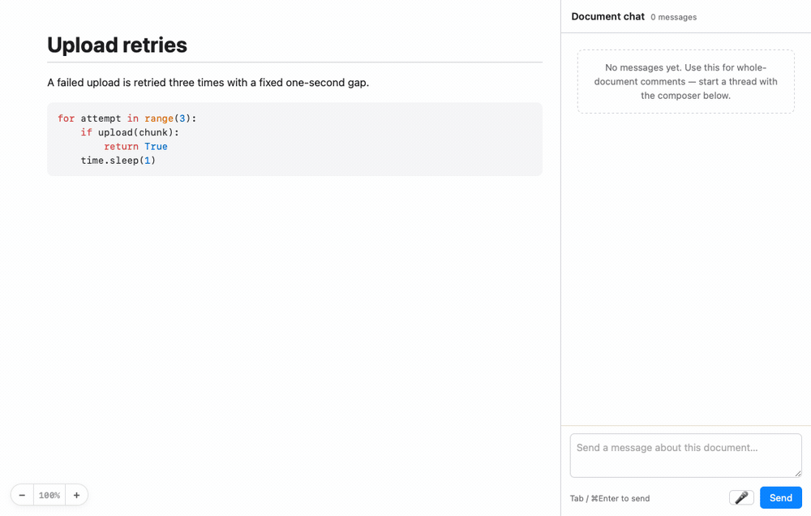

<p align="center">
  
</p>

<h1 align="center">human-review</h1>

<p align="center">
  <b>Code review, but the author is your agent — and it fixes things while you read.</b><br>
  A native macOS app. No server, no account, no network.
</p>

<p align="center">
  <a href="#install">Install</a> ·
  <a href="#what-it-is">What it is</a> ·
  <a href="#quick-start">Quick start</a> ·
  <a href="#features">Features</a> ·
  <a href="#cli">CLI</a> ·
  <a href="#contributing">Contributing</a>
</p>

---

## Install

Paste this to your coding agent:

```
Clone https://github.com/nvgoldin/human-review into ~/src/human-review and run
./install.sh. Then symlink skills/human-review into my agent's skills directory
so /human-review works, and tell me if I need to change my PATH.
```

Or do it yourself:

```bash
git clone https://github.com/nvgoldin/human-review.git ~/src/human-review
cd ~/src/human-review && ./install.sh
export PATH="$HOME/bin:$PATH"        # add to your shell rc

# optional: the Claude Code skill, so /human-review works
ln -sfn ~/src/human-review/skills/human-review ~/.claude/skills/human-review
```

Needs macOS 13+ and the Xcode Command Line Tools (`xcode-select --install`).
Then point it at any file:

```bash
human-review notes.md
```

## What it is

Your agent writes a plan, a design note, a migration script. You need to read it
and push back. Today that means scrolling a terminal, quoting fragments back,
and hoping the agent understood which paragraph you meant.

human-review gives that conversation the shape it already has a good answer for:
**a code review**. You comment on the exact line or paragraph. The agent replies
in the thread, makes the change, and resolves it — while you keep reading.

The difference from a pull request is the latency. There is no push, no CI, no
round trip. You type a comment; the agent has already read it and is editing the
file. When the agent changes the document, the window reloads under you and your
threads follow the text they were anchored to.

Two audiences, one state. **You get a GUI. Your agent gets a shell.** Every
interaction is a `human-review <subcommand>` call, and every change is a line in
a plain-text log next to your file.

### What it is not

- **Not a PR tool.** No branches, no diffs, no merge. You review a *file*, not a
  changeset.
- **Not collaborative.** One human, one machine, local files. No accounts, no
  sharing, no realtime cursors.
- **Not a chat window.** Comments anchor to text. If you want a chat, use a chat.
- **Not cross-platform.** macOS only, and it will stay that way.
- **Not a sandbox.** It renders local markdown, including raw HTML. Do not point
  it at files you do not trust.

It is opinionated on purpose: the sidecar files are the source of truth, the CLI
is the whole API, and anything the GUI can do the shell can do.

## Quick start

Open a file, comment on a line, watch the agent pick it up:

<p align="center">
  
</p>

That loop from the agent's side is four shell commands:

```bash
human-review notes.md &                                     # show the human a window

ROOT=$(human-review add notes.md --line 42 \
         --body "does this still hold?" | jq -r '.id')      # ask a question

human-review wait notes.md --reply-to "$ROOT" --timeout 600 # block until they answer

human-review add notes.md --reply-to "$ROOT" --body "fixed, thanks."
human-review resolve notes.md --id "$ROOT"
```

Or the other way round: the human comments first, and the agent tails the stream
and answers as things arrive.

```bash
human-review watch notes.md --types added,resolved | jq -r '.comment.body'
```

## What it looks like

Markdown gets per-paragraph threads, a resolved-thread history, and a
whole-document chat in the sidebar:


Code gets a line gutter — click a line number to start a thread on it:


Images render from relative paths, and anything that would hit the network is
shown as a marker instead of being fetched:


## Features

- **Per-block threads in markdown**, per-line threads in code. Syntax
  highlighting for ~35 languages, mermaid diagrams, cross-file link previews.
- **Threaded replies**, resolve and reopen, and read receipts — you can see the
  moment the agent has actually read you (✓✓).
- **A document-wide sidebar chat** for the points that are not about one
  paragraph.
- **Images**, from relative or absolute paths, with no network fetches ever.
- **Live reload.** An agent writing to the file or the comments from any shell
  updates your open window; your half-typed reply survives it.
- **Threads follow the text.** After the agent rewrites the document, `reload`
  re-anchors every thread and tells you which ones lost their home.
- **A preferences prompt.** Tell the tool once how you like replies written, and
  it hands that to whichever agent drives it, on every command.
- **`⌘F` search** across text, comments and authors. Zoom. macOS dictation with
  `Fn`-`Fn` — talk your comments instead of typing them.
- **Headless render** for a script or CI: does this document still render, and
  are all its images resolving?
- **Plain files.** Three sidecars next to your source, all human-readable. Delete
  them and the review is gone; commit them and it travels.

## CLI

`human-review --help` is the full surface and the single source of truth. The
shape of it:

### Mutate

```
human-review add      FILE --line N        --body "TEXT" [--author NAME]
human-review add      FILE --reply-to UUID --body "TEXT"
human-review add      FILE --global        --body "TEXT"      # whole-document thread
human-review resolve  FILE --id UUID
human-review reopen   FILE --id UUID
human-review delete   FILE --id UUID                          # a root deletes its thread
human-review reload   FILE                                    # re-anchor after an edit
human-review attention FILE --id UUID                         # scroll the GUI to a comment
```

Each prints the resulting record as JSON and appends one line to the event log.

### Read

```
human-review list     FILE [--scope block|global|all]
human-review threads  FILE [--active|--settled]
human-review get      FILE --id UUID
human-review ack      FILE --id UUID
```

### Subscribe and block

```
human-review watch  FILE [FILE …] [--from-start] [--types added,resolved,…]
human-review wait   FILE --reply-to UUID [--from-author NAME] [--timeout S]
human-review wait   FILE --resolve UUID  [--timeout S]
human-review wait   FILE --exit          [--timeout S]
```

`watch` streams the event log as JSONL and never returns. `wait` exits 0 with the
matching event, or 124 on timeout.

### Render without a window

```
human-review render FILE [--out shot.png] [--overlay LINKED.md] [--click SELECTOR]
```

Prints a JSON report — block count, every image with whether it loaded, every
blocked or missing marker — and optionally writes a PNG. This is how the GUI
itself is tested.

### Preferences

```
human-review config --global global.promptFile ~/.review-rules.md
human-review prompt
```

Whatever that file says is printed to **stderr** on every command, so the agent
driving the tool reads your rules in its own transcript without being told to
look. Stdout stays machine-parseable. Keep it to a few lines — it costs tokens on
every call.

Silence it with `--no-prompt`, `HUMAN_REVIEW_NO_PROMPT=1`, or
`global.promptQuiet`.

### Files on disk

For `notes.md`:

| File | What it is |
|---|---|
| `notes.md` | your source. Never modified by the app. |
| `notes.md.comments.json` | canonical state, rewritten atomically on every change |
| `notes.md.events.jsonl` | append-only log — this is what `watch` tails |
| `notes.review.md` | a readable copy with `> [!review]` callouts |

### Keyboard

| Key | Action |
|---|---|
| `↑` `↓` or `k` `j` | Move between blocks or lines |
| `Enter` | Comment on the focused block, or reply to its thread |
| `n` / `N` | Next / previous unresolved thread |
| `Tab` or `⌘Enter` | Submit |
| `⌘F` | Search text, comments and authors |
| `⌘]` `⌘[` | Next / previous file |
| `⌘R` | Reload from disk and re-anchor |
| `Fn Fn` | Dictate into the focused composer |

## Links and images

A link to another **local file** opens as a preview overlay inside the window,
with a button to pull that file into the session. **Every other link goes to your
default browser** — the review window never navigates away from itself.

Images use CommonMark's four forms plus a raw ``. Relative paths resolve
against the directory of the file under review. Nothing is fetched over the
network: an `https` image renders as a visible marker instead. There is no
standard for image sizing in CommonMark or GFM, so none is invented here — use
``.

## Development

```bash
swift build            # debug
./run-tests.sh         # black-box tests against the built binary
./install.sh           # rebuild, repackage, re-sign, reinstall
./icon/build-icon.sh   # re-render the icon from its SVG
```

Tests drive the real binary as a subprocess, the way an agent does. They never
read your real config. `run-tests.sh` picks the right toolchain flags — with only
the Command Line Tools installed, plain `swift test` cannot work — and it fails
loudly on a run that executes zero tests.

`.githooks/pre-commit` runs `gitleaks` over staged changes; `install.sh` wires it
up.

Architecture notes and the load-bearing invariants — the ones that look like
style until you break one — are in [`HANDOFF.md`](HANDOFF.md).

## Contributing

Issues and pull requests welcome. What helps:

1. **Say what you observed**, not what you concluded. Paste the command and its
   output.
2. **Add a test.** `./run-tests.sh` must be green, and new behavior needs a case
   in `Tests/HumanReviewTests/`.
3. **Keep the CLI the whole API.** If the GUI can do it, the shell should too,
   and `--help` is updated in the same commit.
4. **No new dependencies** without a good reason. The three bundled JavaScript
   libraries are the whole supply chain and it should stay that way.

The interface lives entirely in `Sources/human-review/Resources/viewer.html` —
you can change how it looks and behaves without touching Swift.

## Limitations

- macOS only.
- `events.jsonl` grows forever; `human-review prune FILE` truncates it.
- Re-anchoring after an external edit is best-effort. A thread whose text is gone
  is marked orphaned rather than silently dropped.
- A running window cannot be told to open another file from the CLI. Pass them
  all at launch.
- Raw HTML in a reviewed document executes, as it does in any markdown renderer
  without a sanitizer. Review files you trust.

## License

MIT · bundles [marked](https://github.com/markedjs/marked),
[highlight.js](https://github.com/highlightjs/highlight.js) and
[mermaid](https://github.com/mermaid-js/mermaid).
