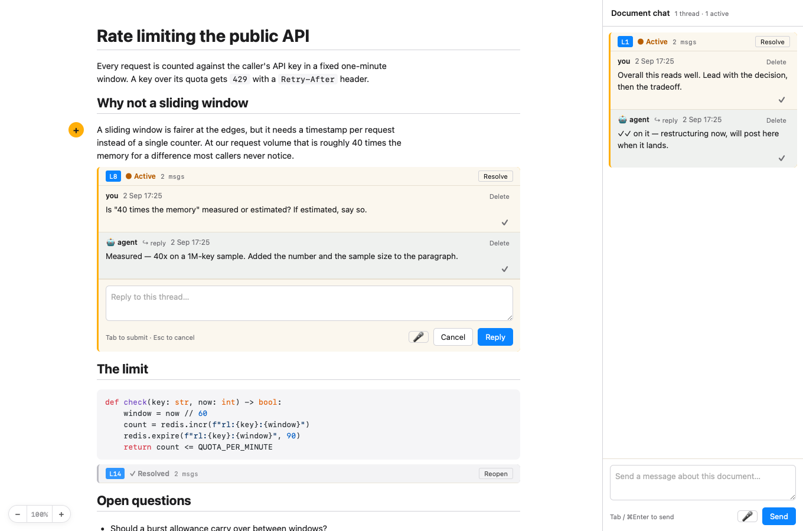
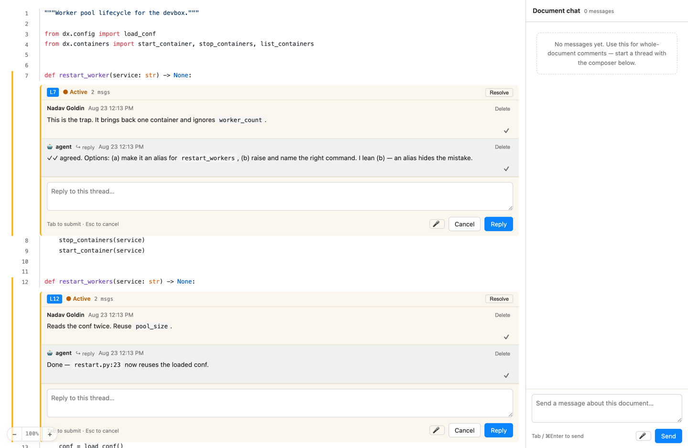
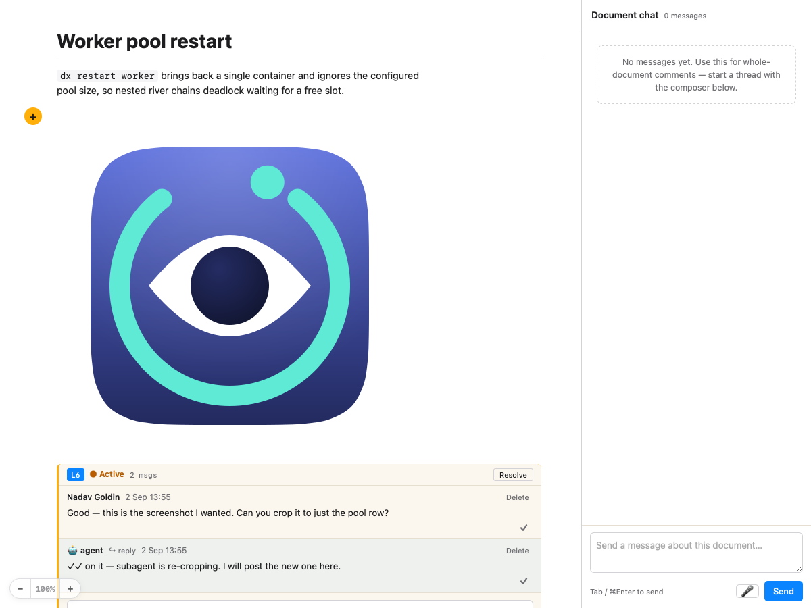

<p align="center">
  
</p>

# human-review

Native macOS app for local, GitHub-style review of markdown and code
files. Built for **humans (GUI)** and **agents (pure shell)** at the same
time — every interaction is a `human-review <subcommand>` call, and a
running GUI auto-reloads whenever an external process changes the
sidecar files.

- Per-block comments in `.md` files (with syntax-highlighted code fences,
  mermaid diagrams, and cross-file link previews).
- Per-line comments in `.py` / `.txt` / `.js` / `.go` / `.rs` / … — hljs
  syntax highlighting, GitHub-style gutter, click a line number to start
  a thread on that line.
- Threaded replies, resolve/reopen, orphaned-thread tracking, read
  receipts (✓✓), whole-document (sidebar) chat threads.
- `⌘F` search across code + comments + author names, floating zoom
  widget, macOS dictation via `Fn`-`Fn`, composer drafts that survive
  agent posts.
- A per-user preferences prompt that the CLI hands back to whichever
  agent is driving it, so your review style is enforced without you
  restating it.
- No web server, no daemon, no login, no network calls at runtime. The
  sidecar files are your source of truth.

<sub>See [`HANDOFF.md`](HANDOFF.md) for architectural notes and
load-bearing invariants.</sub>

## Install

**Requirements:** macOS 13+ and Swift 5.9+ (ships with Xcode Command Line
Tools — `xcode-select --install` if you don't have them).

```bash
git clone https://github.com/nvgoldin/human-review.git ~/src/human-review
cd ~/src/human-review
./install.sh
```

`install.sh` builds release, assembles a `.app` bundle at
`~/Applications/human-review.app`, installs the app icon, ad-hoc
code-signs the bundle (needed so macOS attributes microphone/dictation
permission to it), points `core.hooksPath` at the repo's gitleaks
pre-commit hook, and symlinks `~/bin/human-review` at the in-bundle
binary. Make sure `~/bin` is on your `PATH`:

```bash
export PATH="$HOME/bin:$PATH"       # add to your ~/.zshrc or ~/.bashrc
```

Then:

```bash
human-review notes.md              # or foo.py, bar.txt, README.md, …
```

**Customizing the bundle identifier.** The default is
`io.github.nvgoldin.human-review`. Override with an env var:

```bash
BUNDLE_ID=dev.you.human-review ./install.sh
```

(TCC — the permission gate for mic/dictation — keys on this identifier,
so keep it stable once you've granted permission.)

## What it looks like

You launch it against any file:

```bash
human-review path/to/notes.md
human-review path/to/module.py
human-review a.md b.md c.md            # multi-file session; ⌘] / ⌘[ to switch
```

The window has three panes: the doc/code on the left, per-block or
per-line threads inline, and a global-chat sidebar on the right for
whole-document conversations.



Code files get a line gutter, syntax highlighting, and threads anchored
to a line:



Every change writes to three sidecars next to your source file:

```
notes.md                     source (untouched)
notes.md.comments.json       canonical state — atomically rewritten on each mutation
notes.md.events.jsonl        append-only log — tail this for live updates
notes.review.md              human-readable copy with > [!review] callouts
```

## Keyboard

| Shortcut | Action |
|---|---|
| `↑` / `↓` (`k` / `j`) | Move focus between blocks or lines |
| `Enter` | Open composer — replies to active thread if any, else new |
| `n` / `N` | Jump to next / previous active thread (wraps) |
| `Tab` or `⌘Enter` | Submit composer |
| `Esc` | Cancel composer |
| `⌘F` | In-doc search (code, comments, authors) |
| `⌘+` / `⌘-` / `⌘0` | Zoom in / out / reset |
| `⌘]` / `⌘[` | Next / previous file |
| `⌘R` | Reload source from disk with re-anchor |
| `⌘W` | Close window (fires `exit` event) |
| `Fn Fn` | Start macOS dictation into the focused composer |

## Agent CLI

Everything the GUI does is available as shell subcommands. Full surface
is `human-review --help`.

### Mutate

```
human-review add     FILE --line N       --body "TEXT" [--author NAME]
human-review add     FILE --reply-to UUID --body "TEXT" [--author NAME]
human-review add     FILE --global       --body "TEXT"                # whole-doc chat
human-review resolve FILE --id UUID
human-review reopen  FILE --id UUID
human-review delete  FILE --id UUID                                   # root deletes the thread
human-review reload  FILE                                             # re-anchor after edits
human-review attention FILE --id UUID                                 # pulse the GUI's focus
```

Each command prints the resulting record as JSON and appends one line to
the events log.

### Read

```
human-review list    FILE                       # all comments (JSON array)
human-review threads FILE [--active|--settled]  # thread roots + reply counts
human-review get     FILE --id UUID             # one comment
```

### Render

```
human-review render FILE [--out PNG] [--overlay LINKED.md]   # check how a file renders
```

Prints a JSON report of what rendered and, with `--out`, a PNG. See
[Images](#images).

### Subscribe

```
human-review watch FILE [FILE2 ...]             # tail events.jsonl; blocks
  [--from-start]                                # replay from beginning
  [--types added,resolved,…]                    # filter event types
```

### Block-and-wait

Exit 0 on match (printing the matching event JSON), exit 124 on timeout.

```
human-review wait FILE --reply-to UUID [--from-author NAME] [--timeout S]
human-review wait FILE --resolve   UUID                     [--timeout S]
human-review wait FILE --exit                               [--timeout S]
```

## Full agent flow (pure shell)

```bash
# 1. Show a GUI to the human
human-review notes.md &

# 2. Post an inline review note, capture the thread root id
ROOT=$(human-review add notes.md --line 42 \
         --body "verify the claim about X" | jq -r '.id')

# 3. Block until the human replies (up to 10 minutes)
REPLY=$(human-review wait notes.md --reply-to "$ROOT" --timeout 600)
echo "human said: $(echo "$REPLY" | jq -r '.comment.body')"

# 4. Follow up, then resolve
human-review add notes.md --reply-to "$ROOT" --body "thanks, addressed."
human-review resolve notes.md --id "$ROOT"
```

That's the whole loop. There is no client library, no long-lived
subprocess, no protocol beyond `--help`. The LLM invokes these
commands via its `Bash` tool the same way it invokes `git` or `jq`.

## Images

Markdown images render, in the document and in comment bodies alike. All four
CommonMark forms work — inline, full reference, collapsed, shortcut — plus a
raw `` tag:

```markdown


![logo][brand]

[brand]: assets/logo.svg
```

A relative path resolves against the directory holding the file under review,
not your working directory. Absolute paths work. `data:` URIs render as-is.



**Nothing is fetched over the network.** An `http`/`https` image is never
requested — it renders as a visible marker showing the URL, so you can see that
the document wanted one. A path that does not exist renders as an "image not
found" marker with the resolved path. Neither fails silently.

### Sizing

CommonMark defines no syntax for image dimensions, and neither does GFM. The
`{width=50%}` (Pandoc, GitLab, Quarto) and `=100x200` (markdown-it-imsize,
HedgeDoc) forms are renderer extensions, not standards, and the bundled marked
implements neither. Rather than invent a dialect, use a raw `` — the same
answer GitHub and Typora give:

```html

```

### Checking a file renders

```bash
human-review render notes.md --out /tmp/check.png
```

Loads the real viewer offscreen and prints one JSON line — block count, every
image with whether it loaded, and every blocked or missing marker — then writes
a PNG. Useful in a script, and it is how the GUI itself is tested.

### How it works, and what it does not protect you from

Images are served over an internal `hrimg:` URL scheme rather than `file:`. Two
reasons: the page's base URL is `viewer.html` inside the `.app`, so relative
paths would resolve into the bundle; and WebKit's read access is scoped to that
same bundle directory, so `file:` URLs elsewhere are refused. Serving the bytes
from Swift also avoids inlining images into the payload, which is re-sent on
every comment.

Any local file you can read can be referenced. That is deliberate, and it is
not a security boundary: marked passes raw HTML through, so a hostile markdown
file can already run script in the viewer regardless of how image paths are
treated. Event-handler attributes and `srcset` are stripped from every image —
marked 15 does not escape the image description, so ``
would otherwise inject one — but **review markdown you do not trust at your own
risk.** The property that is guaranteed is the offline one: no image causes a
network call.

## Preferences — telling the agent how you review

Every reviewer wants replies handled differently. Rather than repeating
that to each new agent session, put it in a config file once. The CLI
prints it to **stderr** on every command, so whichever agent is driving
the tool reads your rules in its own transcript without being asked.

```bash
human-review config --global global.promptFile ~/.review-rules.md
human-review prompt                    # what the agent sees
```

Then any command carries it:

```console
$ human-review add notes.md --line 12 --body "…"
── human-review · your review preferences (config global.prompt) ──
1. EDIT the document. It says what is true now — never append "UPDATE:".
2. Reply fast. Acknowledge every comment the moment you see it.
3. Spawn a subagent to do the work, so the review thread never blocks.
── follow these when you reply to comments ──
{ "id": "…", … }
```

Only stderr carries the banner. Stdout stays machine-parseable, so
`human-review add … | jq -r .id` is unaffected.

### `human-review config`

Modelled on `git config`, with two scopes and the same key syntax:

| Scope | File |
|---|---|
| Global | `~/.human-reviewconfig` |
| Local | nearest `.human-review.config`, walking up from the working directory |

Local wins over global. Unlike git, **writes default to `--global`** —
the prompt is a per-user preference, and a stray config file in a working
directory would be a surprise.

```
human-review config [--global|--local] KEY [VALUE]     get / set
human-review config [--global|--local] --unset KEY
human-review config [--global|--local] --list          merged when no scope given
human-review config [--global|--local] --path
human-review config [--global|--local] --edit          opens $VISUAL / $EDITOR / vi
human-review prompt                                    print the effective prompt
```

| Key | Meaning |
|---|---|
| `global.prompt` | The preference text, inline. |
| `global.promptFile` | Path to a file holding it. Wins over `global.prompt`. |
| `global.promptQuiet` | `true` suppresses the banner. `human-review prompt` still works. |

Suppress the banner for one command with `--no-prompt`, or for a whole
shell with `HUMAN_REVIEW_NO_PROMPT=1`. Do that on long-lived streams such
as `watch`, where one banner per process is noise.

Keep the text short. It is injected into an agent's context on every
call, so a page of rules costs real tokens; six lines does the job.

## Claude Code skill

[`skills/human-review/SKILL.md`](skills/human-review/SKILL.md) is a
ready-made skill that teaches an agent the whole loop: open the GUI
without blocking, arm a persistent monitor on the event stream, answer
every comment in-thread, edit the document rather than appending to it,
and close the session with no active threads left.

Load it by symlinking it into your skills directory — the repo stays the
source of truth, so `git pull` updates the skill:

```bash
ln -sfn ~/src/human-review/skills/human-review ~/.claude/skills/human-review
```

Then `/human-review` in a session, or a phrase like "put this doc up for
review".

## Links

A markdown link to another **local file** opens as a preview overlay inside the
window, with an **Open in review** button that adds it to the session:

```markdown
satisfies [the FSR](/Users/me/docs/fsr.md#section-6-4)
```

**Every other link opens in your default browser** — `http`, `https`, `mailto`,
`tel`, and `target="_blank"` alike. The review window never navigates away from
itself, so a stray click cannot cost you the session.

## Comment record

```jsonc
{
  "id":         "UUID",
  "replyTo":    "UUID" | null,     // null = thread root
  "scope":      "block" | "global",
  "anchorLine": 42,                // 0-indexed; meaningful only for scope=block
  "anchorText": "first 80 chars of the anchored block",
  "body":       "…",               // rendered as GFM markdown in the GUI
  "author":     "you" | "agent" | …,
  "createdAt":  "ISO8601",
  "resolved":   false,             // only meaningful on the root
  "orphaned":   false,             // true if reload couldn't relocate anchorText
  "readBy":     ["agent", …]       // ack list (✓✓)
}
```

## Events

All state changes append to `FILE.events.jsonl`. Sample types: `added`,
`edited`, `deleted`, `resolved`, `reopened`, `read`, `reloaded`,
`gui_opened`, `gui_closed`, `attention`, `exit`. JSON keys are
alphabetically sorted (stable across releases).

## Bundled resources

No runtime network. Ships with:

- [`marked`](https://github.com/markedjs/marked) — markdown → HTML
- [`highlight.js`](https://github.com/highlightjs/highlight.js) — syntax
  highlighting (common language pack, ~35 languages)
- [`mermaid`](https://github.com/mermaid-js/mermaid) — diagrams from
  ` ```mermaid ` fenced blocks

## Development

```bash
swift build                          # debug
./run-tests.sh                       # CLI integration suite
swift build -c release               # release (what install.sh calls)
./install.sh                         # rebuild + repackage + re-sign the .app
./icon/build-icon.sh                 # re-render bundle/AppIcon.icns from the SVG
```

The whole GUI is `Sources/human-review/Resources/viewer.html` — you can
iterate on the JS/CSS without touching Swift and see changes immediately
after `./install.sh` (or `swift build -c release`) and a window reopen.

### Tests

`./run-tests.sh` runs a black-box suite against the built binary: it
shells out to real subcommands in a temp directory, so it exercises the
same surface an agent does. Every test points `HUMAN_REVIEW_CONFIG` at a
throwaway file and never reads your real config.

The suite is written with swift-testing. With Xcode installed, plain
`swift test` runs it. With only the Command Line Tools there is no
`XCTest.framework` on the machine and SwiftPM leaves the Command Line
Tools framework directory off the search path, so three extra flags are
needed — `run-tests.sh` adds them when it detects that toolchain. It also
fails when a run reports success having executed zero tests, which is
what you get if the test target quietly fails to link against
`Testing.framework`.

### Secret scanning

`.githooks/pre-commit` runs `gitleaks git --staged` before every commit.
`install.sh` wires `core.hooksPath` for you; to do it by hand:

```bash
brew install gitleaks
git config core.hooksPath .githooks
```

`.gitleaks.toml` extends the default rule set and allowlists the vendored
minified bundles, whose entropy otherwise trips the generic rules.

## Limitations

- macOS only (no Linux / Windows port).
- `events.jsonl` grows forever. Run `human-review prune FILE` if it
  becomes large.
- Re-anchoring after external edits is best-effort: roots keep the
  first 80 chars of the block as `anchorText` and re-search on `⌘R` /
  `reload`. Unmatched roots get `orphaned: true` and render in a
  separate section.
- A running GUI cannot be told to open another file from the CLI. Pass
  every file in the launch command, or click **Open in review** in a
  cross-link preview.

## License

MIT
